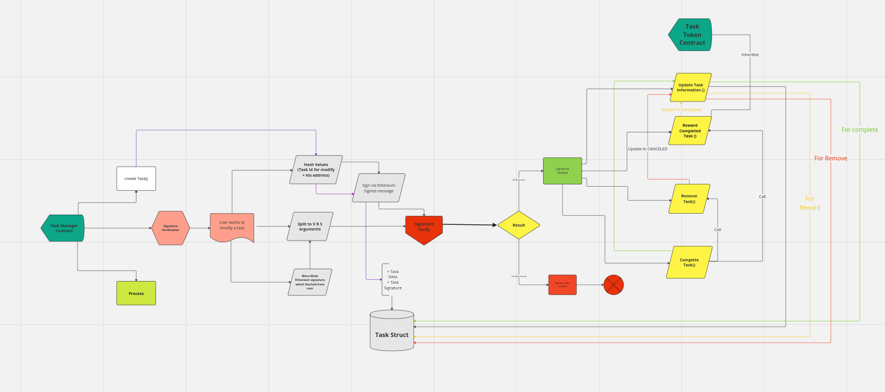

# Task Manager Smart Contract

web3-task-manager a task manager based on Ethereum smart contract using brownie and reactJs.

In this app beside creating and managing your tasks, users can reward Task token after completing their own tasks.

NOTE: this smart contract is not gas efficient on mainnet

## Installation

### via `pipx`

The recommended way to install Brownie is via [`pipx`](https://github.com/pipxproject/pipx). pipx installs Brownie into a virtual environment and makes it available directly from the commandline. Once installed, you will never have to activate a virtual environment prior to using Brownie.

To install `pipx`:

```bash
python3 -m pip install --user pipx
python3 -m pipx ensurepath
```

To install Brownie using `pipx`:

```bash
pipx install eth-brownie
```

To upgrade to the latest version:

```bash
pipx upgrade eth-brownie
```

To use lastest master or another branch as version:
```bash
pipx install git+https://github.com/eth-brownie/brownie.git@master
```

### via `pip`

You can install the latest release via [`pip`](https://pypi.org/project/pip/):

```bash
pip install eth-brownie
```

### via `setuptools`

You can clone the repository and use [`setuptools`](https://github.com/pypa/setuptools) for the most up-to-date version:

```bash
git clone https://github.com/eth-brownie/brownie.git
cd brownie
python3 setup.py install
```

## Task Manager smart contract architecture




## Authors

- [@octokatherine](https://www.github.com/ParsaAminpour)


## License

[MIT](https://choosealicense.com/licenses/mit/)
